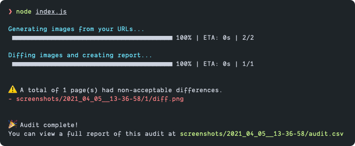

# 🎨 Visual Differ
A Node-based auditing tool to visually diff pages



## 🤔 What is it?

Have you ever made a change that negatively impacted the front-end? Checking one page for a change might be easy. Checking hundreds is difficult and time-consuming.

**Visual Differ** allows you to supply an array of URLs to audit and will create an `audit.csv` to show which comparisons passed and which ones had a non-trivial difference as defined in your config file.

Additionally, you can review the screenshots that were taken and see a "heatmap" of the visual differences thanks to [the pixelmatch library](https://github.com/mapbox/pixelmatch).


## ✅ Usage
1. Download the project
2. Install dependencies `npm i`
3. Copy `config.example.js` to `config.js`
4. Modify your `config.js` values and supply your array of URLs to test
5. Run `node index.js` to create screenshots, diffs and generate an `audit.csv` file

## ⚙️ Configuring your Test

You can easily modify the parameters of your test in the `config.js` file (after copying `config.example.js` to `config.js`). Below are all of the options you can modify.

```js
module.exports = {
  // The viewport to use when creating images from the URLs
  viewport: {
    width: 1280,
    height: 800,
  },

  // Matching threshold, ranges from 0 to 1. Smaller values make the comparison more sensitive. 0.1 by default.
  // See pixelmatch for more information: https://github.com/mapbox/pixelmatch#api
  diffThreshold: 0.1,

  // The number of pixels in the diff that, once reached, will be flagged in the audit during the testing
  nonacceptableDiff: 10,

  // The maximum amount of screenshot requests to run concurrently. Careful.
  maxConcurrency: 2,

  // The URLs to test for visual differences
  urls: [
    {
      // The first URL to test
      a: "https://time.is/Los_Angeles",

      // The URL to compare the first test to
      b: "https://time.is/New_York",

      // Need to pass in some custom CSS to your test so you can hide or change elements?
      // Provide as much CSS you need and it will be applied when navigating to the URLs
      css: ``,
    },
  ],
};
```
